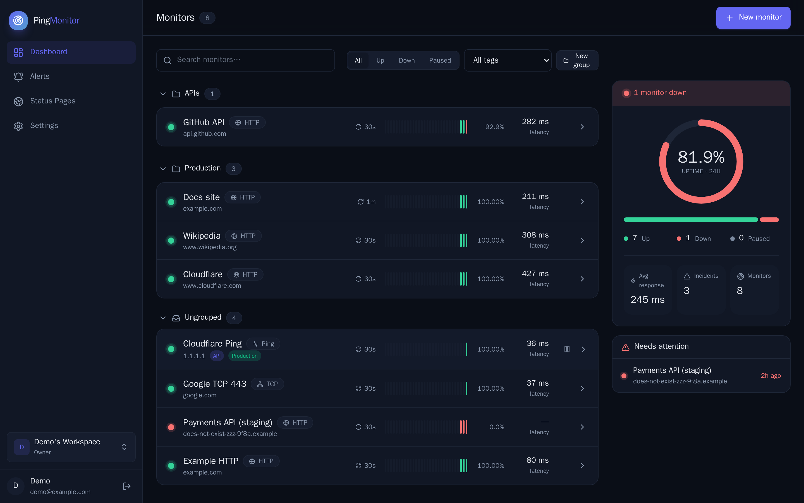
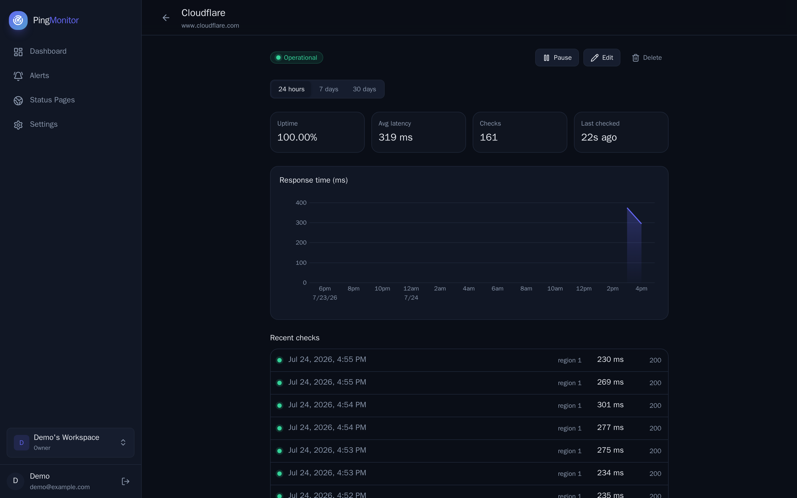
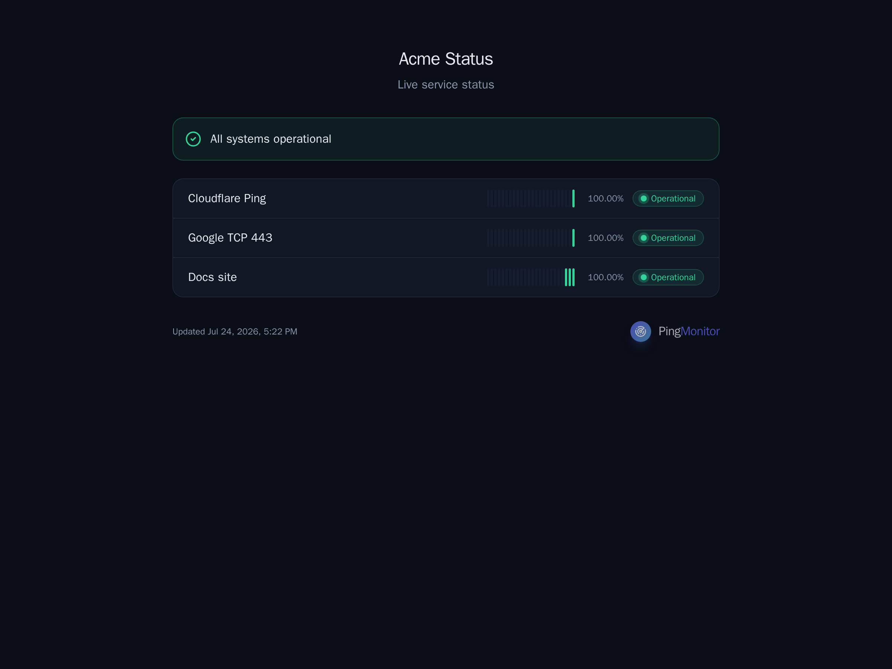
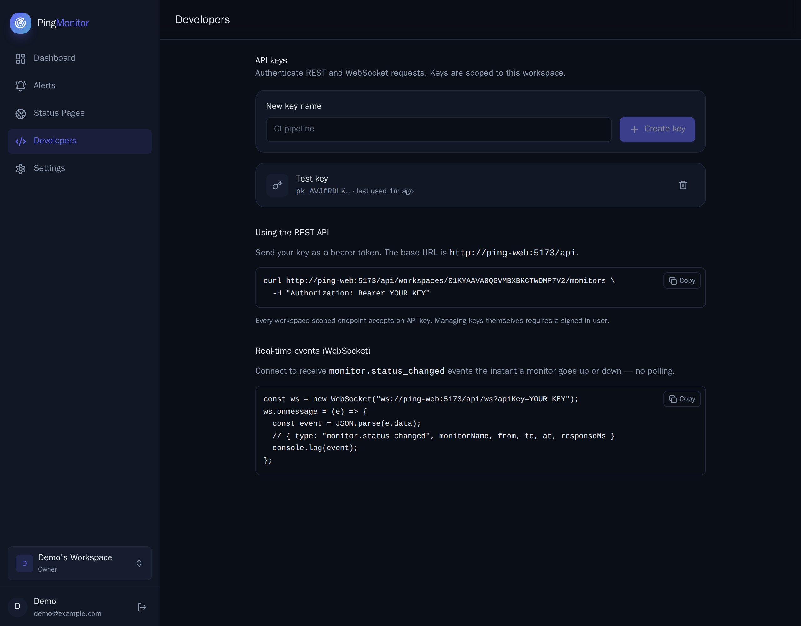
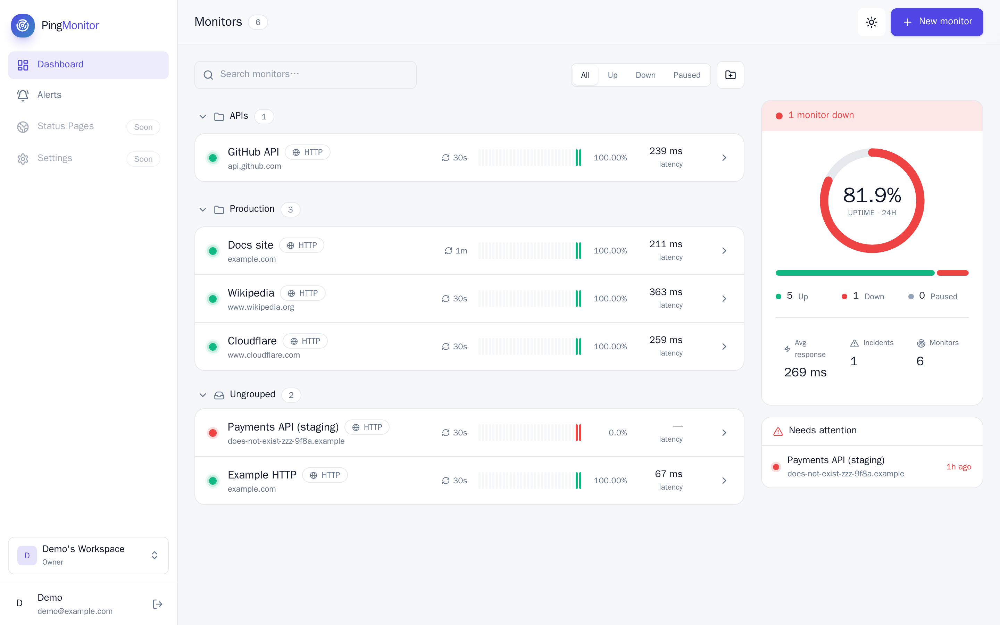
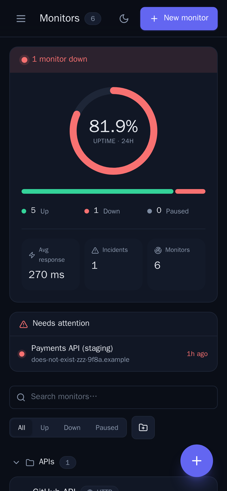

<h1 align="center">🛰️ Ping Monitor</h1>

<p align="center">
  <b>Self-hosted, open-source uptime monitoring.</b><br/>
  Monitor websites, APIs and servers with HTTP / TCP / ICMP checks, SSL & JSON
  health assertions, multi-channel alerts, public status pages, and a real-time API —
  built to scale from one site to millions on plain PostgreSQL, Redis and Node.js.
</p>

<p align="center">
  <a href="https://github.com/jodacame/ping-monitor/actions/workflows/ci.yml"></a>
  <a href="LICENSE"></a>
  
  
  
  
  
  
</p>

<p align="center">
  
</p>

> A modern, open-source alternative for **website monitoring**, **server monitoring**
> and **status pages** — think Uptime Kuma / Better Uptime, self-hosted and yours.

---

## ✨ Features

- **Monitor types** — **HTTP/HTTPS**, **TCP** port, and **ICMP ping**.
- **Deep health checks** — assert on status code, response time, headers, plain body,
  or a **JSON path** value, combined with **AND/OR** groups. Optional **SSL
  certificate-expiry** alerts and body keyword checks.
- **Anti-false-positive** — a monitor flips only after N consecutive failures
  (per region), and recovers after M successes.
- **Global monitoring** — deploy probe workers in multiple regions; overall status
  is decided by **quorum** (down only when *K* regions agree).
- **Alerts, per monitor** — pick which channels each monitor uses: **Email (SMTP)**,
  **Telegram**, or a **generic Webhook** (custom method, headers, auth, and a
  `{{variable}}` body template for any API).
- **Public status pages** — publish a branded page at `/status/:slug` (no auth).
- **Groups, tags & filters** — organise and slice your monitors.
- **Statistics & charts** — uptime, latency and incident history over 24h / 7d / 30d,
  plus **CSV export**.
- **Developer API** — a **REST API** and a **real-time WebSocket** for status-change
  events, secured with scoped, expiring, IP-restricted **API keys**, rate limiting
  and security headers. See [`docs/API.md`](docs/API.md).
- **Beautiful UI** — React + Vite, light/dark, fully responsive, dedicated pages
  with real URLs.

## 📸 Screenshots

|  |  |
|--|--|
| **Monitor detail** — charts, checks, incidents | **Public status page** |
|  |  |
| **Developer API & keys** | **Light theme** |
|  |  |

<p align="center"></p>

## 🚀 Quick start (Docker)

Requirements: Docker + Docker Compose.

```bash
git clone https://github.com/jodacame/ping-monitor.git
cd ping-monitor
cp .env.example .env
# edit .env: set a strong JWT_SECRET  →  openssl rand -base64 48

docker compose up -d --build
# open the dashboard:  http://localhost:8080
```

Scale the probe workers horizontally:

```bash
docker compose up -d --scale worker=3
```

The bundle runs its own PostgreSQL and Redis. For **multi-region** monitoring,
deploy extra `worker` containers on hosts in other regions (each with a distinct
`PROBE_REGION`), all pointing at the same Postgres and Redis.

## 🧭 Architecture

```
                        ┌───────────────┐
      REST / SPA / WS ──▶     API       │  auth · monitors · stats · API keys · WS
                        └──────┬────────┘
                               │ Postgres
      ┌───────────────┐        ▼
      │   Scheduler   │──▶ claims due (monitor, region) checks  (FOR UPDATE SKIP LOCKED)
      └──────┬────────┘        │
        Redis Stream  ┌────────▼─────────┐   Postgres
   checks:pending:R ──▶     Worker(s)    │──▶ check_results (day-partitioned)
                        │  region = R    │──▶ hourly / daily rollups · incidents
                        └──────┬─────────┘──▶ publish
                               │ events:monitor ─▶ Notifier (alerts) · WebSocket (live)
```

A pnpm monorepo, TypeScript end-to-end, SOLID and event-driven. The hot
`check_results` table is **range-partitioned by day** (vanilla PostgreSQL, no
extensions) with pre-aggregated rollups. See
[`docs/ARCHITECTURE.md`](docs/ARCHITECTURE.md).

**Packages:** `core` (domain + retry state machine), `config`, `db`, `queue`
(Redis Streams), `checks`, `notifications`.
**Apps:** `api`, `scheduler`, `worker`, `notifier`, `web`.

## 🛠️ Development

Runs on Node 26 with **pnpm**.

```bash
pnpm install
pnpm --filter @ping/db run migrate    # apply schema
pnpm seed                             # optional: example monitors (HTTP/TCP/ICMP,
                                      #           simple + complex health checks)
pnpm dev:api                          # API      (:3000)
pnpm dev:scheduler                    # scheduler
pnpm dev:worker                       # worker
pnpm dev:notifier                     # alert dispatcher
pnpm dev:web                          # dashboard (:5173)
```

Quality gates: `pnpm typecheck` · `pnpm test` (Vitest) · `pnpm lint`.

## 🔌 API & real-time events

Authenticate the REST API and WebSocket with a workspace-scoped API key created
under **Developers** in the app.

```bash
curl https://your-host/api/workspaces/WORKSPACE_ID/monitors \
  -H "Authorization: Bearer pk_xxx"
```

```js
const ws = new WebSocket("wss://your-host/api/ws", ["pk_xxx"]);
ws.onmessage = (e) => console.log(JSON.parse(e.data)); // monitor.status_changed
```

Full reference: [`docs/API.md`](docs/API.md).

## 🗺️ Roadmap

- [x] HTTP / TCP / ICMP monitors · SSL expiry · health assertions (AND/OR)
- [x] Alerts (Email, Telegram, Webhook), per monitor · groups · tags · CSV export
- [x] Public status pages · developer API keys · real-time WebSocket
- [ ] Per-region latency/uptime breakdown in the UI
- [ ] Two-factor auth · audit log · ephemeral WebSocket tickets

## 🤝 Contributing

Contributions are welcome — see [`CONTRIBUTING.md`](CONTRIBUTING.md).

## 📄 License

[MIT](LICENSE) © [jodacame](https://github.com/jodacame) and Ping Monitor contributors.

---

<p align="center">
  🤖🧑‍🚀 <b>Friendly disclaimer:</b> this was built by an AI and a human keeping an eye on
  it (mostly saying "yes, ship it"). It started as a personal project, but it's free
  and open — so if it saves your bacon at 3&nbsp;a.m. when prod goes down, it's yours.
  No warranties, just good vibes and a decent test suite. Use it, fork it, break it,
  make it better. 🛰️💚
</p>

<p align="center"><sub>Keywords: uptime monitoring · status page · website monitoring · server monitoring · HTTP/TCP/ICMP/ping monitor · SSL monitoring · self-hosted · open source · Docker · PostgreSQL · TypeScript · React · Uptime Kuma alternative</sub></p>
